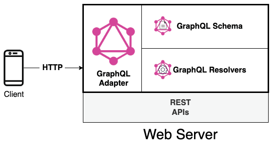

# Developing a GraphQL API

GraphQL is growing in popularity, and every day, more and more services expose their API using this query language. The GQL API interface will help your API consumers to retrieve the minimal set of data they need, benefiting from intuitive and always up-to-date documentation. GraphQL is a first-class citizen in the Fastify ecosystem. Let’s learn how to add GraphQL handlers using a dedicated plugin, avoiding common pitfalls and taking advantage of Fastify’s peculiar architecture.

Here’s the learning path we will cover in this chapter:

-   What is GraphQL?
-   Writing the GQL schema
-   How to make live a GQL schema?
-   How to improve resolver performance?
-   Managing GQL errors

## Technical requirements

To complete this chapter successfully, you will need:

-   A working Node.js 18 installation
-   The [VS Code IDE](https://code.visualstudio.com/)
-   A working command shell

All the snippets in this chapter are on [GitHub](https://github.com/PacktPublishing/Accelerating-Server-Side-Development-with-Fastify/tree/main/Chapter%2014).

## What is GraphQL?

GraphQL is a new language that has changed how a web server exposes data and how the client consumes it. Considering our application’s data structure, we could map every data source to a graph of nodes (objects) and edges (relations) to connect them.

Here’s a quick example of a GraphQL query that maps a family and its members:

```graphql
query {
    family(id: 5) {
        id
        members {
            fullName
            friends {
                fullName
            }
        }
    }
}
```

By reading our first GraphQL query, we can immediately understand the relation hierarchy. A `Family` entity has many `Person` as a `members` array property. Each item of `members` may have some `Person` entities as `friends`. Commonly, a GQL request string is called a **GQL document**.

The JSON response to our GQL query request could be as follows:

```json
{
    "data": {
        "family": {
            "id": 5,
            "members": [
                {
                    "fullName": "Foo Bar",
                    "friends": []
                },
                {
                    "fullName": "John Doe",
                    "friends": [
                        { "fullName": "Michael Gray" },
                        { "fullName": "Greta Gray" }
                    ]
                },
                {
                    "fullName": "Jane Doe",
                    "friends": [
                        { "fullName": "Greta Gray" }
                    ]
                }
            ]
        }
    }
}
```

Seeing the previous quick example, you may guess that if you wanted to get the same data by using a REST API architecture, you should have executed many HTTP calls, such as:

-   Calling the `GET /family/5` endpoint to get the family members
-   Calling `GET /person/id` for each member to get the person’s friends

This easy communication is guaranteed because GraphQL is a declarative, intuitive, and flexible language that lets us focus on the data shape. Its scope is to develop a structured and productive environment to simplify the client’s API fetching.

To reach its goals, it has many design principles:

-   **Product-centric**: The language is built around the consumers’ requirements and data visualization
-   **Hierarchical**: The request has a hierarchical shape that defines the response data structure
-   **Strong-typing**: The server defines the application type system used to validate every request and document the response results
-   **Client-specified response**: The client knows the server capabilities and which one it is allowed to consume
-   **Introspective**: The GraphQL service’s type system can be queried using GraphQL itself to create powerful tools

These principles drive the GraphQL specification, and you can find more about them at <http://spec.graphql.org/>.

But what do you need to implement the GraphQL specification? Let’s find out in the next section.

### How does Fastify support GraphQL?

GraphQL describes the language, but we must implement the specification to support its grammar. So, we are going to see how to implement GraphQL in Fastify while we explore the specification. We will write the source code to support the GQL example we saw in the previous section.

First, we need to identify the components. The following diagram shows the architectural concepts that support GraphQL:



<center>Figure 14.1 – Basic GraphQL component architecture</center>

_Figure 14.1_ shows us a few essential concepts about GraphQL:

-   Any client can execute a GraphQL document by performing an HTTP request to the web server.
-   The web server understands the GQL request, using a **GraphQL adapter** that interfaces with the **GraphQL schema** definition and the **GraphQL resolvers**. You are going to learn all these concepts further in the [How to make live a GQL schema?](#how-to-make-live-a-gql-schema) section.
-   A web server could expose some REST APIs besides the GQL one without any issues.

The straightforward process we are going to follow to implement our first GraphQL server is as follows:

1.  Define the GQL schema.
2.  Write a simple Fastify server.
3.  Add the `mercurius` plugin, and the GraphQL adapter designed for Fastify, to the Fastify installation.
4.  Implement the GQL resolvers.

So, let’s start working on the GQL syntax to write our first schema.

## Writing the GQL schema

We must write the GQL schema by using its **type system**. If we think first about our data, it will be easier to implement it. Let’s try to convert the following diagram to a schema:

**330**
