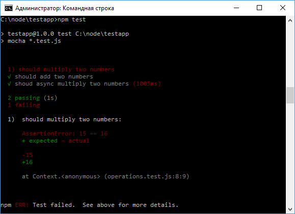

# Assert

В предыдущей теме для верификации результата теста полученное значение сравнивалось с ожидаемым результатом:

```js
if (result !== expectedResult) {
    throw new Error(
        `Expected ${expectedResult}, but got ${result}`
    );
}
```

Подобное сравнение является довольно тривиальным и фактически используется во многих тестах с небольшими изменениями. И специально чтобы упростить верификацию результатов в тестах для Node.js был создан специальный модуль - [`assert`](../../api/assert.md). Кроме того, есть различные библиотеки, которые еще называют `Assertions` и которые служат той же цели: `should.js`, `expect.js` и т. д. Но в данном случае мы рассмотрим работу с модулем `assert`.

## equal

Функция `assert.equal()` сравнивает два значения. Если они не равны, то генерируется ошибка. Например, возьмем определенную в модуле `operations.js` функцию умножения двух чисел:

```js
module.exports.multiply = function (x, y) {
    return x * y;
};
```

Протестируем ее:

```js
var assert = require('assert');
var operations = require('./operations');

it('should multiply two numbers', function () {
    var expected = 15;
    var result = operations.multiply(3, 5);
    assert.equal(result, expected);
});
```

Если оба значения будут равны, то мы опять же увидим в консоли, что тесты пройдены. Если же значения не будут равны, то мы увидим красные маркеры с сообщениями об ошибке:



Определенно вариант с функцией `assert.equal` проще, чем если бы мы сравнивали вручную два значения и сами генерировали ошибку с некоторым сообщением.

В противоположность этой функции функция `assert.notEqual()` генерирует ошибку, если оба значения равны:

```js
it('should multiply two numbers', function () {
    var expected = 15;
    var result = operations.multiply(3, 5);
    assert.notEqual(result, expected);
});
```
