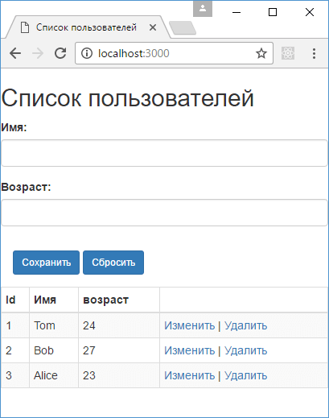

# Создание API

Используя Express и Node.js, мы можем реализовать полноценный API в стиле REST для взаимодействия с пользователем. Архитектура REST предполагает применение следующих методов или типов запросов HTTP для взаимодействия с сервером:

-   `GET`
-   `POST`
-   `PUT`
-   `DELETE`

Зачастую REST-стиль особенно удобен при создании всякого рода Single Page Application, которые нередко используют специальные javascript-фреймворки типа Angular, React или Knockout.

Рассмотрим, как создать свой API. Для нового проекта создадим новую папку, которая пусть будет называться `webapp`. Сразу определим в проекте файл `package.json`:

```json
{
    "name": "webapp",
    "version": "1.0.0",
    "dependencies": {
        "body-parser": "^1.16.0",
        "express": "^4.14.0"
    }
}
```

В проекте нам понадобятся `express` и `body-parser` для парсинга полученных данных.

Далее перейдем к этому каталогу в командной строке/терминале и для добавления всех нужных пакетов выполним команду:

```
npm install
```

В данном случае мы создадим экспериментальный проект, который будет хранить данные в файле json и который призван просто показать создание API в Node.js в стиле REST. А пока добавим в папку проекта новый файл `users.json` со следующим содержанием:

```json
[
    {
        "id": 1,
        "name": "Tom",
        "age": 24
    },
    {
        "id": 2,
        "name": "Bob",
        "age": 27
    },
    {
        "id": 3,
        "name": "Alice",
        "age": "23"
    }
]
```

Для чтения и записи в этот файл мы будем использовать встроенный модуль `fs`. Для обработки запросов определим в проекте следующий файл `app.js`:

```js
var express = require('express');
var bodyParser = require('body-parser');
var fs = require('fs');

var app = express();
var jsonParser = bodyParser.json();

app.use(express.static(__dirname + '/public'));
// получение списка данных
app.get('/api/users', function (req, res) {
    var content = fs.readFileSync('users.json', 'utf8');
    var users = JSON.parse(content);
    res.send(users);
});
// получение одного пользователя по id
app.get('/api/users/:id', function (req, res) {
    var id = req.params.id; // получаем id
    var content = fs.readFileSync('users.json', 'utf8');
    var users = JSON.parse(content);
    var user = null;
    // находим в массиве пользователя по id
    for (var i = 0; i < users.length; i++) {
        if (users[i].id == id) {
            user = users[i];
            break;
        }
    }
    // отправляем пользователя
    if (user) {
        res.send(user);
    } else {
        res.status(404).send();
    }
});
// получение отправленных данных
app.post('/api/users', jsonParser, function (req, res) {
    if (!req.body) return res.sendStatus(400);

    var userName = req.body.name;
    var userAge = req.body.age;
    var user = { name: userName, age: userAge };

    var data = fs.readFileSync('users.json', 'utf8');
    var users = JSON.parse(data);

    // находим максимальный id
    var id = Math.max.apply(
        Math,
        users.map(function (o) {
            return o.id;
        })
    );
    // увеличиваем его на единицу
    user.id = id + 1;
    // добавляем пользователя в массив
    users.push(user);
    var data = JSON.stringify(users);
    // перезаписываем файл с новыми данными
    fs.writeFileSync('users.json', data);
    res.send(user);
});
// удаление пользователя по id
app.delete('/api/users/:id', function (req, res) {
    var id = req.params.id;
    var data = fs.readFileSync('users.json', 'utf8');
    var users = JSON.parse(data);
    var index = -1;
    // находим индекс пользователя в массиве
    for (var i = 0; i < users.length; i++) {
        if (users[i].id == id) {
            index = i;
            break;
        }
    }
    if (index > -1) {
        // удаляем пользователя из массива по индексу
        var user = users.splice(index, 1)[0];
        var data = JSON.stringify(users);
        fs.writeFileSync('users.json', data);
        // отправляем удаленного пользователя
        res.send(user);
    } else {
        res.status(404).send();
    }
});
// изменение пользователя
app.put('/api/users', jsonParser, function (req, res) {
    if (!req.body) return res.sendStatus(400);

    var userId = req.body.id;
    var userName = req.body.name;
    var userAge = req.body.age;

    var data = fs.readFileSync('users.json', 'utf8');
    var users = JSON.parse(data);
    var user;
    for (var i = 0; i < users.length; i++) {
        if (users[i].id == userId) {
            user = users[i];
            break;
        }
    }
    // изменяем данные у пользователя
    if (user) {
        user.age = userAge;
        user.name = userName;
        var data = JSON.stringify(users);
        fs.writeFileSync('users.json', data);
        res.send(user);
    } else {
        res.status(404).send(user);
    }
});

app.listen(3000, function () {
    console.log('Сервер ожидает подключения...');
});
```

Для обработки запросов определено пять методов для каждого типа запросов: `app.get()`/`app.post()`/`app.delete()`/`app.put()`

Когда приложение получает запрос типа GET по адресу `api/users`, то срабатывает следующий метод:

```js
app.get('/api/users', function (req, res) {
    var content = fs.readFileSync('users.json', 'utf8');
    var users = JSON.parse(content);
    res.send(users);
});
```

В качестве результата обработки мы должны отправить массив пользователей, которые считываем из файла. Для упрощения кода приложения в рамках данного экспериментального проекта для чтения/записи файла применяются синхронные методы `fs.readFileSync()`/`fs.writeFileSync()`. Но в реальности, как правило, работа с данными будет идти через базу данных, а далее мы все это рассмотрим на примере MongoDB.

И чтобы получить данные из файла с помощью метода `fs.readFileSync()` считываем данные в строку, которую парсим в массив объектов с помощью функции `JSON.parse()`. И в конце полученные данные отправляем клиенту методом `res.send()`.

Аналогично работает другой метод `app.get()`, который срабатывает, когда в адресе указан `id` пользователя:

```js
app.get('/api/users/:id', function (req, res) {
    var id = req.params.id; // получаем id
    var content = fs.readFileSync('users.json', 'utf8');
    var users = JSON.parse(content);
    var user = null;
    // находим в массиве пользователя по id
    for (var i = 0; i < users.length; i++) {
        if (users[i].id == id) {
            user = users[i];
            break;
        }
    }
    // отправляем пользователя
    if (user) {
        res.send(user);
    } else {
        res.status(404).send();
    }
});
```

Единственное, что в этом случае нам надо найти нужного пользователя по `id` в массиве, а если он не был найден, возвратить статусный код `404`: `res.status(404).send()`.

При получении запроса методом `POST` нам надо применить парсер `jsonParser` для извлечения данных из запроса:

```js
// получение отправленных данных
app.post('/api/users', jsonParser, function (req, res) {
    if (!req.body) return res.sendStatus(400);

    var userName = req.body.name;
    var userAge = req.body.age;
    var user = { name: userName, age: userAge };

    var data = fs.readFileSync('users.json', 'utf8');
    var users = JSON.parse(data);

    // находим максимальный id
    var id = Math.max.apply(
        Math,
        users.map(function (o) {
            return o.id;
        })
    );
    // увеличиваем его на единицу
    user.id = id + 1;
    // добавляем пользователя в массив
    users.push(user);
    var data = JSON.stringify(users);
    // перезаписываем файл с новыми данными
    fs.writeFileSync('users.json', data);
    res.send(user);
});
```

После получения данных нам надо создать новый объект и добавить его в массив объектов. Для этого считываем данные из файла, добавляем в массив новый объект и перезаписываем файл с обновленными данными.

При удалении производим похожие действия, только теперь извлекаем из массива удаляемый объект и опять же перезаписываем файл:

```js
app.delete('/api/users/:id', function (req, res) {
    var id = req.params.id;
    var data = fs.readFileSync('users.json', 'utf8');
    var users = JSON.parse(data);
    var index = -1;
    // находим индекс пользователя в массиве
    for (var i = 0; i < users.length; i++) {
        if (users[i].id == id) {
            index = i;
            break;
        }
    }
    if (index > -1) {
        // удаляем пользователя из массива по индексу
        var user = users.splice(index, 1)[0];
        var data = JSON.stringify(users);
        fs.writeFileSync('users.json', data);
        // отправляем удаленного пользователя
        res.send(user);
    } else {
        res.status(404).send();
    }
});
```

Если объект не найден, возвращаем статусный код `404`.

Если приложению приходит PUT-запрос, то он обрабатывается методом `app.put()`, в котором с помощью `jsonParser` получаем измененные данные:

```js
app.put('/api/users', jsonParser, function (req, res) {
    if (!req.body) return res.sendStatus(400);

    var userId = req.body.id;
    var userName = req.body.name;
    var userAge = req.body.age;

    var data = fs.readFileSync('users.json', 'utf8');
    var users = JSON.parse(data);
    var user;
    for (var i = 0; i < users.length; i++) {
        if (users[i].id == userId) {
            user = users[i];
            break;
        }
    }
    if (user) {
        user.age = userAge;
        user.name = userName;
        var data = JSON.stringify(users);
        fs.writeFileSync('users.json', data);
        res.send(user);
    } else {
        res.status(404).send(user);
    }
});
```

Здесь также для поиска изменяемого объекта считываем данные из файла, находим изменяемого пользователя по `id`, изменяем у него свойства и сохраняем обновленные данные в файл.

Таким образом, мы определили простейший API. Теперь добавим код клиента. Итак, как установлено в коде, Express для хранения статических файлов использует папку `public`, поэтому создадим в проекте подобную папку. В этой папке определим новый файл `index.html`, который будет выполнять роль клиента. В итоге весь проект будет выглядеть следующим образом:


Далее определим в файле `index.html` следующий код:

```html
<!DOCTYPE html>
<html>
    <head>
        <meta charset="utf-8" />
        <meta
            name="viewport"
            content="width=device-width"
        />
        <title>Список пользователей</title>
        <link
            href="https://maxcdn.bootstrapcdn.com/bootstrap/3.3.7/css/bootstrap.min.css"
            rel="stylesheet"
        />
        <script src="https://code.jquery.com/jquery-2.2.4.min.js"></script>
    </head>
    <body>
        <h2>Список пользователей</h2>
        <form name="userForm">
            <input type="hidden" name="id" value="0" />
            <div class="form-group">
                <label for="name">Имя:</label>
                <input class="form-control" name="name" />
            </div>
            <div class="form-group">
                <label for="age">Возраст:</label>
                <input class="form-control" name="age" />
            </div>
            <div class="panel-body">
                <button
                    type="submit"
                    class="btn btn-sm btn-primary"
                >
                    Сохранить
                </button>
                <a id="reset" class="btn btn-sm btn-primary"
                    >Сбросить</a
                >
            </div>
        </form>
        <table
            class="table table-condensed table-striped table-bordered"
        >
            <thead>
                <tr>
                    <th>Id</th>
                    <th>Имя</th>
                    <th>возраст</th>
                    <th></th>
                </tr>
            </thead>
            <tbody></tbody>
        </table>

        <script>
            // Получение всех пользователей
            function GetUsers() {
                $.ajax({
                    url: '/api/users',
                    type: 'GET',
                    contentType: 'application/json',
                    success: function (users) {
                        var rows = '';
                        $.each(users, function (
                            index,
                            user
                        ) {
                            // добавляем полученные элементы в таблицу
                            rows += row(user);
                        });
                        $('table tbody').append(rows);
                    },
                });
            }
            // Получение одного пользователя
            function GetUser(id) {
                $.ajax({
                    url: '/api/users/' + id,
                    type: 'GET',
                    contentType: 'application/json',
                    success: function (user) {
                        var form =
                            document.forms['userForm'];
                        form.elements['id'].value = user.id;
                        form.elements['name'].value =
                            user.name;
                        form.elements['age'].value =
                            user.age;
                    },
                });
            }
            // Добавление пользователя
            function CreateUser(userName, userAge) {
                $.ajax({
                    url: 'api/users',
                    contentType: 'application/json',
                    method: 'POST',
                    data: JSON.stringify({
                        name: userName,
                        age: userAge,
                    }),
                    success: function (user) {
                        reset();
                        $('table tbody').append(row(user));
                    },
                });
            }
            // Изменение пользователя
            function EditUser(userId, userName, userAge) {
                $.ajax({
                    url: 'api/users',
                    contentType: 'application/json',
                    method: 'PUT',
                    data: JSON.stringify({
                        id: userId,
                        name: userName,
                        age: userAge,
                    }),
                    success: function (user) {
                        reset();
                        $(
                            "tr[data-rowid='" +
                                user.id +
                                "']"
                        ).replaceWith(row(user));
                    },
                });
            }

            // сброс формы
            function reset() {
                var form = document.forms['userForm'];
                form.reset();
                form.elements['id'].value = 0;
            }

            // Удаление пользователя
            function DeleteUser(id) {
                $.ajax({
                    url: 'api/users/' + id,
                    contentType: 'application/json',
                    method: 'DELETE',
                    success: function (user) {
                        console.log(user);
                        $(
                            "tr[data-rowid='" +
                                user.id +
                                "']"
                        ).remove();
                    },
                });
            }
            // создание строки для таблицы
            var row = function (user) {
                return (
                    "<tr data-rowid='" +
                    user.id +
                    "'><td>" +
                    user.id +
                    '</td>' +
                    '<td>' +
                    user.name +
                    '</td> <td>' +
                    user.age +
                    '</td>' +
                    "<td><a class='editLink' data-id='" +
                    user.id +
                    "'>Изменить</a> | " +
                    "<a class='removeLink' data-id='" +
                    user.id +
                    "'>Удалить</a></td></tr>"
                );
            };
            // сброс значений формы
            $('#reset').click(function (e) {
                e.preventDefault();
                reset();
            });

            // отправка формы
            $('form').submit(function (e) {
                e.preventDefault();
                var id = this.elements['id'].value;
                var name = this.elements['name'].value;
                var age = this.elements['age'].value;
                if (id == 0) CreateUser(name, age);
                else EditUser(id, name, age);
            });

            // нажимаем на ссылку Изменить
            $('body').on('click', '.editLink', function () {
                var id = $(this).data('id');
                GetUser(id);
            });
            // нажимаем на ссылку Удалить
            $('body').on(
                'click',
                '.removeLink',
                function () {
                    var id = $(this).data('id');
                    DeleteUser(id);
                }
            );

            // загрузка пользователей
            GetUsers();
        </script>
    </body>
</html>
```

Основная логика здесь заключена в коде javascript. Для упрощения взаимодействия с сервером здесь применяется библиотека jquery. При загрузке страницы в браузере получаем все объекты из БД с помощью функции `GetUsers`:

```js
function GetUsers() {
    $.ajax({
        url: '/api/users',
        type: 'GET',
        contentType: 'application/json',
        success: function (users) {
            var rows = '';
            $.each(users, function (index, user) {
                // добавляем полученные элементы в таблицу
                rows += row(user);
            });
            $('table tbody').append(rows);
        },
    });
}
```

Для добавления строк в таблицу используется функция `row()`, которая возвращает строку. В этой строке будут определены ссылки для изменения и удаления пользователя.

Ссылка для изменения пользователя с помощью функции `GetUser()` получает с сервера выделенного пользователя:

```js
function GetUser(id) {
    $.ajax({
        url: '/api/users/' + id,
        type: 'GET',
        contentType: 'application/json',
        success: function (user) {
            var form = document.forms['userForm'];
            form.elements['id'].value = user.id;
            form.elements['name'].value = user.name;
            form.elements['age'].value = user.age;
        },
    });
}
```

И выделенный пользователь добавляется в форму над таблицей. Эта же форма применяется и для добавления объекта. С помощью скрытого поля, которое хранит `id` пользователя, мы можем узнать, какое действие выполняется - добавление или редактирование. Если `id` равен `0`, то выполняется функция `CreateUser`, которая отправляет данные в POST-запросе:

```js
function CreateUser(userName, userAge) {
    $.ajax({
        url: 'api/users',
        contentType: 'application/json',
        method: 'POST',
        data: JSON.stringify({
            name: userName,
            age: userAge,
        }),
        success: function (user) {
            reset();
            $('table tbody').append(row(user));
        },
    });
}
```

Если же ранее пользователь был загружен на форму, и в скрытом поле сохранился его `id`, то выполняется функция `EditUser`, которая отправляет PUT-запрос:

```js
function EditUser(userId, userName, userAge) {
    $.ajax({
        url: 'api/users',
        contentType: 'application/json',
        method: 'PUT',
        data: JSON.stringify({
            id: userId,
            name: userName,
            age: userAge,
        }),
        success: function (user) {
            reset();
            $(
                "tr[data-rowid='" + user.id + "']"
            ).replaceWith(row(user));
        },
    });
}
```

Запустим приложение, обратимся в браузере по адресу `http://localhost:3000` и мы сможем управлять пользователями, которые хранятся в файле json:


