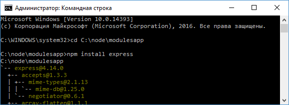
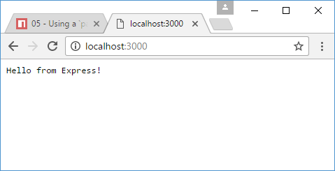
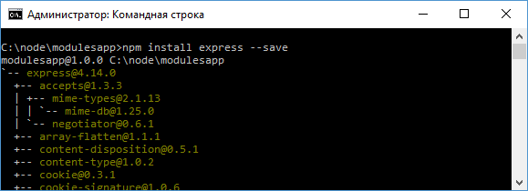
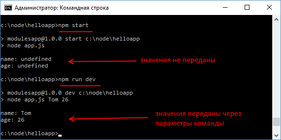

# NPM. Package.json. Установка модулей. Определение команд

Кроме встроенных и кастомных модулей Node.js существует огромный пласт различных библиотек и фреймворков, разнообразных утилит, которые создаются сторонними производителями и которые также можно использовать в проекте, например, express, grunt, gulp и так далее. И они тоже нам доступны в рамках Node.js. Чтобы удобнее было работать со всеми сторонними решениями, они распространяются в виде пакетов. Пакет по сути представляет набор функциональностей.

Для автоматизации установки и обновления пакетов, как правило, применяются систему управления пакетами или менеджеры. Непосредственно в Node.js для этой цели используется пакетный менеджер NPM (Node Package Manager). NPM по умолчанию устанавливается вместе с Node.js, поэтому ничего доустанавливать не требуется. Но можно обновить установленную версию до самой последней. Для этого в командной строке/терминале надо запустить следующую команду:

```
npm install npm@latest -g
```

Чтобы узнать текущую версию `npm`, в командной строке/терминале надо ввести следующую команду:

```
npm -v
```

Для нас менеджер `npm` важен в том плане, что с его помощью легко управлять пакетами. К примеру, создадим на жестком диске новую папку `modulesapp` (В моем случае папка будет находиться по пути `C:\node\modulesapp`).

Далее для примера установим в проект `express`. Express представляет легковесный веб-фреймворк для упрощения работы с Node.js. В данном случае мы не будем пока подробно рассматривать фреймворк Express, так как это отдельная большая тема. А используем его лишь для того, чтобы понять, как устанавливаются сторонние модули в проект.

Для установки функциональности Express в проект вначале перейдем к папке проекта с помощью команды `cd`. Затем введем команду

```
npm install express
```



После установки `express` в папке проекта `modulesapp` появится подпапка `node_modules`, в которой будут храниться все установленные внешние модули. В частности, в подкаталоге `node_modules/express` будут располагаться файлы фреймворка Express.

Далее определим файл простейшего сервера. Для этого в корневую папку проекта `modulesapp` добавим новый файл `app.js`:

```js
// получаем модуль Express
const express = require('express');
// создаем приложение
const app = express();

// устанавливаем обработчик для маршрута "/"
app.get('/', function (request, response) {
    response.end('Hello from Express!');
});
// начинаем прослушивание подключений на 3000 порту
app.listen(3000);
```

Первая строка получает установленный модуль `express`, а вторая создает объект приложения.

В Express мы можем связать обработку запросов с определенными маршрутами. Например, `/` - представляет главную страницу или корневой маршрут. Для обработки запроса вызывается функция `app.get()`. Первый параметр функции - маршрут, а второй - функция, которая будет обрабатывать запрос по этому маршруту.

И чтобы сервер начал прослушивать подключения, надо вызвать метод `app.listen()`, в который передается номер порта.

Запустим сервер командой node `app.js`:


И в адресной строке браузера введем адрес `http://localhost:3000/`:



## Файл package.json

Для более удобного управления конфигурацией и пакетами приложения в npm применяется файл конфигурации `package.json`. Так, добавим в папку проекта `modulesapp` новый файл `package.json`:

```json
{
    "name": "modulesapp",
    "version": "1.0.0"
}
```

Здесь определены только две секции: имя проекта - `modulesapp` и его версия - `1.0.0`. Это минимально необходимое определение файла `package.json`. Данный файл может включать гораздо больше секций. Подробнее можно посмотреть в документации.

Далее удалим из проекта каталог `node_modules`. То есть в папке проекта `modulesapp` будут два файла `app.js` и `package.json`.

Теперь снова добавим `express` с помощью следующей команды:

```
npm install express --save
```

Флаг `--save` указывает, что информацию о добавленном пакете надо добавить в файл `package.json`.



И после выполнения команды, если мы откроем файл `package.json`, то мы увидим информацию о пакете:

```json
{
    "name": "modulesapp",
    "version": "1.0.0",
    "dependencies": {
        "express": "^4.14.0"
    }
}
```

Информация обо всех добавляемых пакетах, которые используются при запуске приложения, добавляется в секцию `dependencies`.

Файл `package.json` играет большую роль и может облегчить разработку в различных ситуациях. Например, при размещении в разных репозиториях нередко мы ограничены выделяемым дисковым пространством, тогда как папка `node_modules` со всеми загруженными пакетами может занимать довольно приличное пространство. В этом случае удобнее разместить основной код проекта без `node_modules`. В этом случае мы можем определить все пакеты в файле `package.json`, а затем для загрузки всех пакетов выполнить команду

```
npm install
```

Эта команда возьмет определение всех пакетов из секций `dependencies` и загрузит их в проект.

## devDependencies

Кроме пакетов, которые применяются в приложении, когда оно запущено, например, express, то есть в состоянии "production", есть еще пакеты, которые применяются при разработке приложения и его тестировании. Такие пакеты добавляются в другую секцию - `devDependencies`. В вышеприведенном примере она не определена, но если бы мы добавили какой-нибудь grunt или gulp, то они бы были именно в секции `devDependencies`.

Например, загрузим в проект пакет `jasmine-node`, который используется для тестирования приложения:

```
npm install jasmine-node --save-dev
```

Флаг `--save-dev` указывается, что информацию о пакете следует сохранить в секции `devDependencies` файла `package.json`:

```json
{
    "name": "modulesapp",
    "version": "1.0.0",
    "dependencies": {
        "express": "^4.14.0"
    },
    "devDependencies": {
        "jasmine-node": "^1.14.5"
    }
}
```

## Удаление пакетов

Для удаления пакетов используется команда `npm uninstall`. Например:

```
npm uninstall express
```

Эта команда удаляет пакет из папки `node_modules`, в то же время в файле `package.json` информация о данном пакете остается. Чтобы удалить информацию также и из `package.json`, применяется флаг `--save`:

```
npm uninstall express --save
```

## Семантическое версионирование

При определении версии пакета применяется семантическое версионирование. Номер версии, как правило, задается в следующем формате `major.minor.patch`. Если в приложении или пакете обнаружен какой-то баг и он исправляется, то увеличивается на единицу число `patch`. Если в пакет добавляется какая-то новая функциональность, которая совместима с предыдущей версией пакета, то это небольшое изменение, и увеличивается число `minor`. Если же в пакет вносятся какие-то большие изменения, которые несовместимы с предыдущей версией, то увеличивается число `major`. То есть глядя на разные версии пакетов, мы можем предположить, насколько велики в них различия.

В примере с express версия пакета содержала, кроме того, дополнительный символ карет: `^4.14.0`. Этот символ означает, что при установке пакета в проект с помощью команды `npm install` будет устанавливаться последняя доступная версия от `4.14.0`. Фактически это будет последняя доступная версия в промежутке от `4.14.0` до `5.0.0` (`>=4.14.0` и `<5.0.0`). Более подробно про семантическое версионирование в `npm` можно посмотреть здесь.

## Команды npm

NPM позволяет определять в файле `package.json` команды, которые выполняют определенные действия. Например, определим следующий файл `app.js`:

```js
let name = process.argv[2];
let age = process.argv[3];

console.log('name: ' + name);
console.log('age: ' + age);
```

В данном случае мы получаем переданные при запуске приложению параметры.

И определим следующий файл `package.json`:

```json
{
    "name": "modulesapp",
    "version": "1.0.0",
    "scripts": {
        "start": "node app.js",
        "dev": "node app.js Tom 26"
    }
}
```

Здесь добавлена секция `scripts`, которая определяет две команды. Вообще команд может быть много в соответствии с целями и задачами разработчика.

Первая команда называется `start`. Она по сути выполняет команду `node app.js`, которая выполняет код в файле `app.js`

Вторая команда называется `dev`. Она также выполняет тот же файл, но при этом также передает ему два параметра.

Названия команд могут быть произвольными. Но здесь надо учитывать один момент. Есть условно говоря зарезервированные названия для команд, например, `start`, `test`, `run` и ряд других. Их не очень много. И как раз первая команда из выше определенного файла `package.json` называется `start`. И для выполнения подобных команд в терминале/командной строке надо выполнить команду

```
npm [название_команды]
```

Например, для запуска команды `start`

```
npm start
```

Команды с остальными названия, как например, `dev` в вышеопределенном файле, запускаются так:

```
npm run [название_команды]
```

Например, последовательно выполним обе команды:


