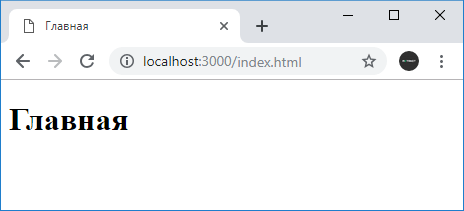

# Отправка статических файлов

Вместо того, чтобы определять код, который получает пользователь, напрямую в файле сервера, гораздо удобнее вынести все в отдельный html-файл. Рассмотрим, как мы можем отправлять статические файла, те же файлы html.

Определим новый каталог проекта. Определим в нем основной файл приложения `app.js`. Для статических файлов создадим отдельную папку `public`, в которую добавим два файла `index.html` и `about.html`. В итоге проект будет выглядеть следующим образом:

-   `app.js`
-   `public`
    -   `about.html`
    -   `index.html`

В файле `index.html` определим какой-нибудь простейший html-код:

```html
<!DOCTYPE html>
<html>
    <head>
        <title>Главная</title>
        <meta charset="utf-8" />
    </head>
    <body>
        <h1>Главная</h1>
    </body>
    <html></html>
</html>
```

Аналогично определим код в файле `about.html`:

```html
<!DOCTYPE html>
<html>
    <head>
        <title>О сайте</title>
        <meta charset="utf-8" />
    </head>
    <body>
        <h1>О сайте</h1>
    </body>
    <html></html>
</html>
```

Наша задача будет заключаться в том, чтобы отправить их содержимое пользователю. Для этого поместим в файл `app.js` следующий код:

```js
const http = require('http');
const fs = require('fs');

http.createServer(function (request, response) {
    console.log(`Запрошенный адрес: ${request.url}`);
    if (request.url.startsWith('/public/')) {
        // получаем путь после слеша
        const filePath = request.url.substr(1);
        fs.readFile(filePath, function (error, data) {
            if (error) {
                response.statusCode = 404;
                response.end('Resourse not found!');
            } else {
                response.setHeader(
                    'Content-Type',
                    'text/html'
                );
                response.end(data);
            }
        });
    } else {
        // во всех остальных случаях отправляем строку hello world!
        response.end('Hello World!');
    }
}).listen(3000);
```

Если запрошенный адрес начинается с `/public/`, то с помощью метода `fs.readFile()` считываем нужный файл по пути и отправляем считанные данные клиенту. В остальных случаях отдаем строку `Hello World!`.

Запустим приложение и в браузере обратимся по адресу `http://localhost:3000`:


Затем обратимся по адресу `http://localhost:3000/public/index.html`:



Аналогично мы можем обратиться по адресу `http://localhost:3000/public/about.html`:


